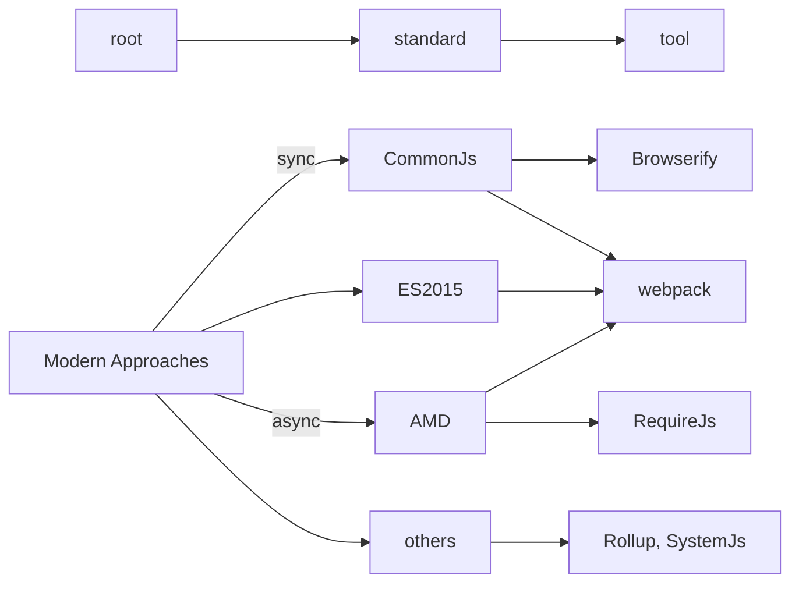

# JavaScript Modules History - Modern

See also [JavaScript Modules History - Ancient][./modules-ancient.md]

```mermaid
graph LR
a[root] --> b[standard]
b --> tool

root[Modern Approaches] --> |sync| cj[CommonJs] 
root --> es6[ES2015]
root --> |async| amd[AMD]
root --> other[others]


cj --> bf[Browserify]
amd --> rj[RequireJs]
other --> x[Rollup, SystemJs] 

cj --> wp[webpack]
es6 --> wp
amd --> wp

```

